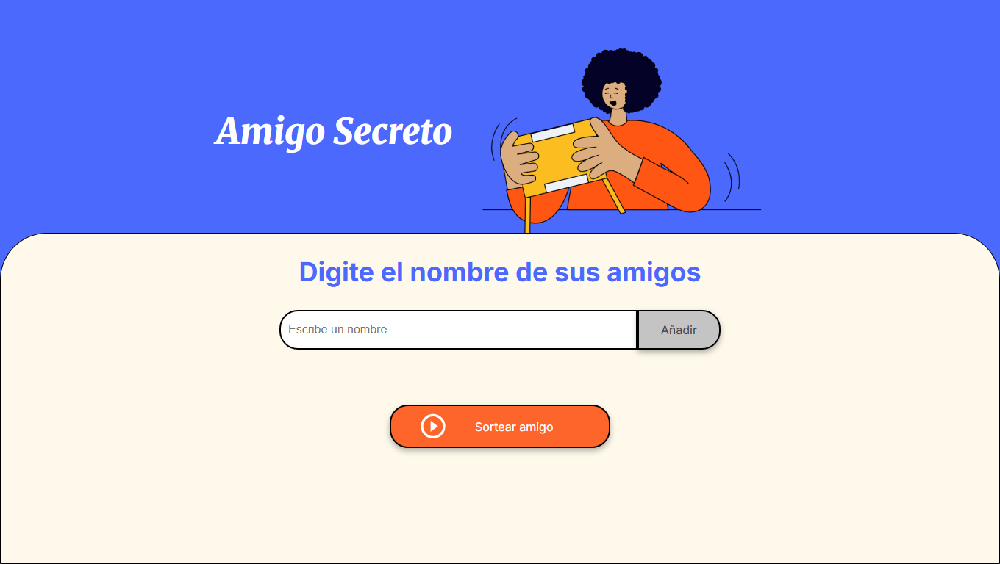
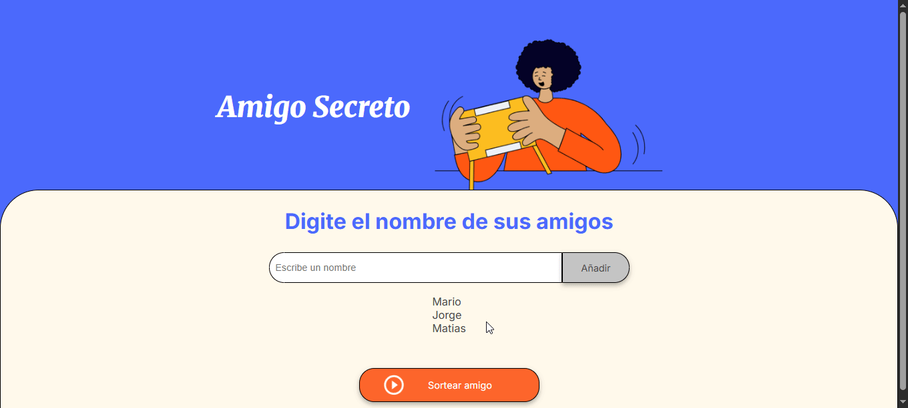

# Amigo Secreto 🎁

Una aplicación web interactiva para organizar sorteos de amigo secreto de manera fácil y divertida.



## 🎬 Demo

### Agregando Participantes


### Realizando el Sorteo


## 📖 Descripción

Amigo Secreto es una aplicación web que permite a los usuarios crear listas de participantes y realizar sorteos aleatorios para determinar quién será el "amigo secreto" de cada persona. Perfecta para organizar intercambios de regalos en oficinas, familias o grupos de amigos.

## ✨ Características

- **Interfaz intuitiva**: Diseño limpio y fácil de usar
- **Validación de datos**: Previene nombres duplicados y entradas vacías
- **Sorteo aleatorio**: Algoritmo de selección aleatoria justo
- **Responsive**: Se adapta a diferentes tamaños de pantalla
- **Accesibilidad**: Implementa buenas prácticas de accesibilidad web

## 🚀 Funcionalidades

### Agregar Participantes
- Ingresa nombres de los participantes uno por uno
- Validación automática para evitar duplicados
- Limpieza automática del campo de entrada

### Visualizar Lista
- Muestra todos los participantes agregados en tiempo real
- Lista organizada y fácil de leer

### Sortear Amigo
- Selección aleatoria de un participante
- Resultado destacado visualmente
- Validación para asegurar que hay participantes antes del sorteo

## 🛠️ Tecnologías Utilizadas

- **HTML5**: Estructura semántica y accesible
- **CSS3**: Estilos modernos con variables CSS y Flexbox
- **JavaScript ES6**: Lógica de la aplicación
- **Google Fonts**: Tipografías Inter y Merriweather

## 📁 Estructura del Proyecto

```
amigo-secreto/
│
├── index.html          # Estructura principal de la aplicación
├── style.css           # Estilos y diseño visual
├── app.js              # Lógica de la aplicación
└── assets/             # Recursos gráficos
    ├── amigo-secreto.png           # Imagen principal de la aplicación
    ├── play_circle_outline.png     # Ícono del botón de sorteo
    ├── pantalla-main.png      # Captura de pantalla principal
    ├── demo-agregar-amigo.gif     # Demo agregando participantes
    └── demo-sortear-amigo.gif       # Demo del proceso de sorteo
```

## 🎨 Diseño

### Paleta de Colores
- **Primario**: `#4B69FD` (Azul vibrante)
- **Secundario**: `#FFF9EB` (Crema suave)
- **Acento**: `#fe652b` (Naranja energético)
- **Texto**: `#444444` (Gris oscuro)

### Tipografías
- **Títulos**: Merriweather (serif, elegante)
- **Interfaz**: Inter (sans-serif, moderna)

## 🚀 Cómo Usar


1. **Agregar Participantes**:
   - Escribe el nombre en el campo de texto
   - Haz clic en "Añadir" o presiona Enter
   - El nombre aparecerá en la lista automáticamente

   

2. **Realizar Sorteo**:
   - Asegúrate de tener al menos un participante
   - Haz clic en "Sortear amigo"
   - El resultado aparecerá destacado en verde

   

3. **Repetir Sorteos**:
   - Puedes realizar múltiples sorteos con la misma lista
   - Cada sorteo es completamente aleatorio e independiente

## 💻 Instalación y Configuración

1. **Clonar o descargar** los archivos del proyecto
2. **Abrir** `index.html` en tu navegador web preferido
3. **¡Listo!** La aplicación funcionará inmediatamente

No requiere instalación de dependencias ni configuración adicional.

## 🔧 Características Técnicas

### Validaciones Implementadas
- Prevención de nombres duplicados
- Validación de campos vacíos
- Verificación de lista no vacía antes del sorteo

### Funciones JavaScript Principales
- `agregarAmigo()`: Gestiona la adición de nuevos participantes
- `agregarAmigosALista()`: Actualiza la visualización de la lista
- `sortearAmigo()`: Ejecuta el algoritmo de sorteo aleatorio

### Accesibilidad
- Etiquetas semánticas HTML5
- Atributos ARIA para lectores de pantalla
- Contraste de colores optimizado
- Navegación por teclado

## 🎯 Casos de Uso

- **Oficinas**: Intercambios navideños entre compañeros
- **Familias**: Sorteos para reuniones familiares
- **Grupos de amigos**: Organización de regalos grupales
- **Eventos**: Dinámicas de integración y team building

---

**¡Disfruta organizando tus intercambios de regalos con Amigo Secreto!** 🎉